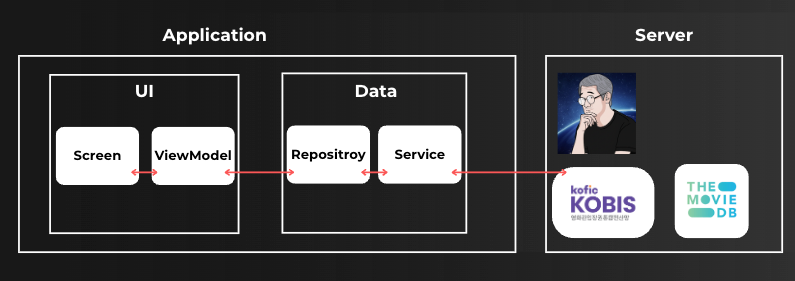
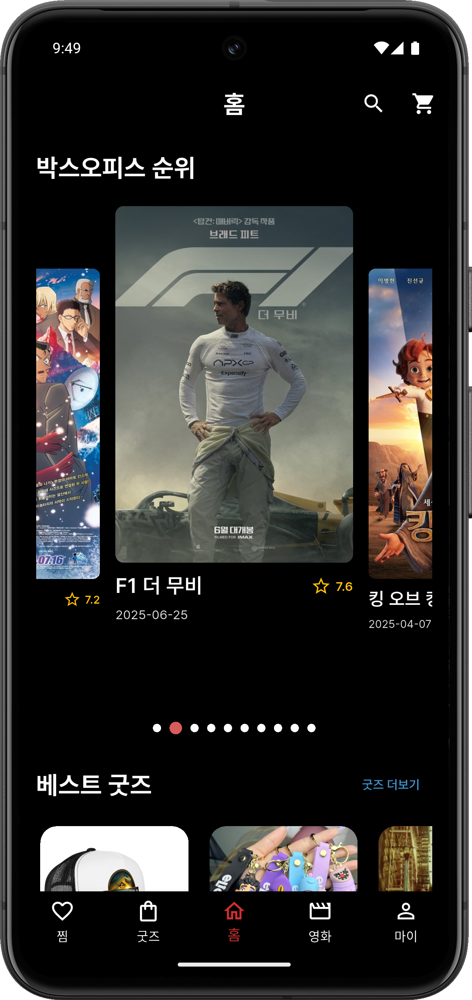
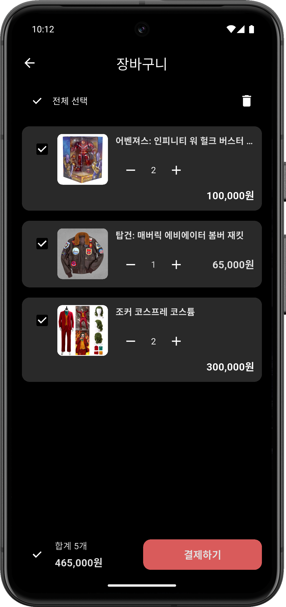
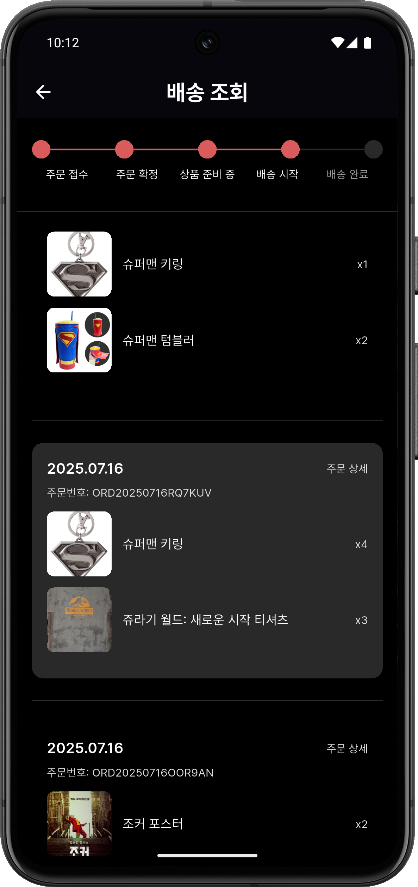
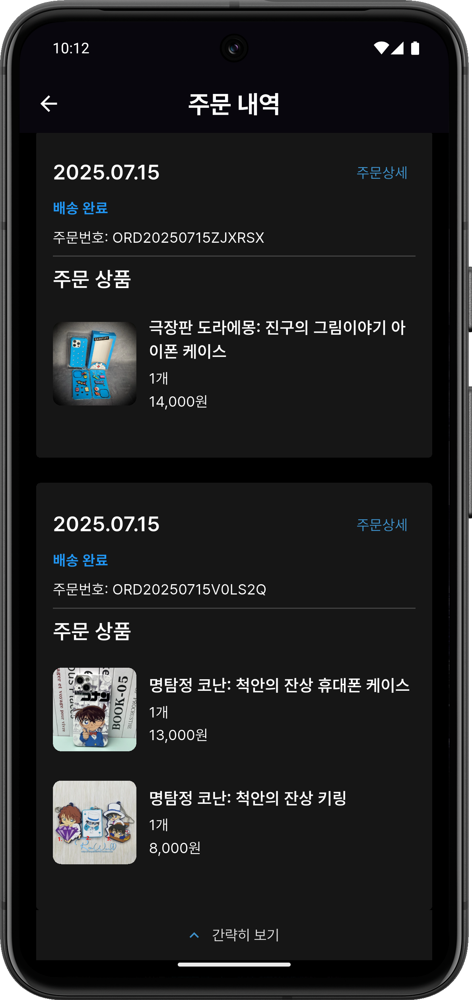
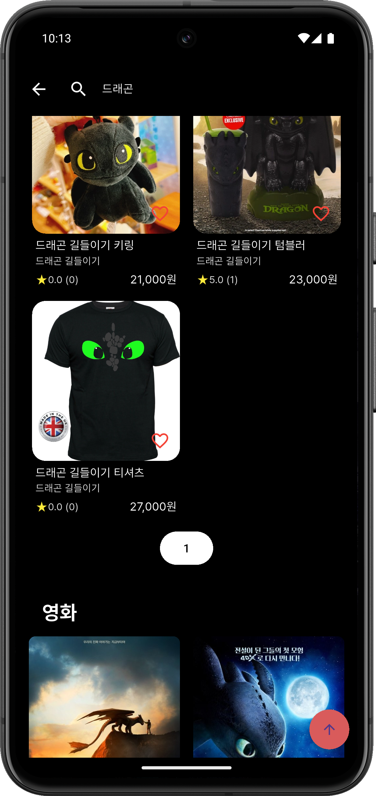
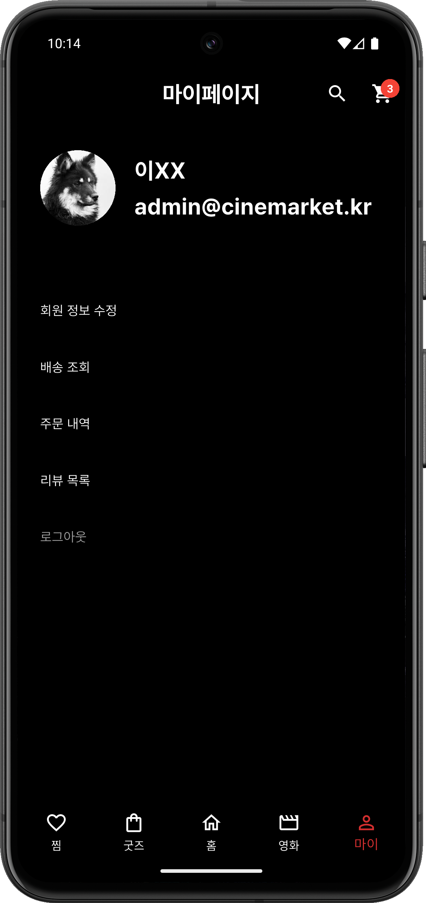

# 🍿 시네마켓(Cinemarket) - 영화 굿즈 플랫폼

> **Cinema + Market**<br>
> **Cinema + Cat**  
> 영화와 관련된 굿즈 상품들을 **소개 & 판매**하는 굿즈 쇼핑 플랫폼입니다.

## 팀 소개

| 이름     | 역할       | GitHub 프로필 |
|----------|------------|----------------|
| 허준서   | 팀장       | [Junseo0324](https://github.com/Junseo0324) |
| 이현제   | 부팀장     | [HyunjeLee](https://github.com/HyunjeLee) |
| 김학록   | 팀원       | [hakrok](https://github.com/hakrok) |
| 홍의정   | 팀원       | [aabc88](https://github.com/aabc88) |


## 기획 의도

OTT 확산의 영향으로 영화는 이제 **일상 속 콘텐츠**로 자리잡았습니다.  
팬들은 인상 깊은 캐릭터와 장면을 굿즈로 **소유하며 감정적 몰입을 유지**합니다.  
**영화 탐색과 굿즈 소비를 하나의 흐름으로 제공**하는 앱을 통해, 팬들에게 더 깊은 영화 경험을 제공합니다.

## 📁 폴더 구조
**Feature-based**
```bash
lib/
├ core/                          # 앱 전반에서 공통적으로 사용하는 코드
│   ├ styles/                   # 공통 스타일 (색상, 텍스트 스타일 등)
│   ├ router.dart               # 라우팅 설정
│   ├ network/                  # API 클라이언트, dio 설정 등
│   └ storage/                  # 로컬 저장소
│
├ features/                     # 도메인별 기능 구성
│   ├ auth/                     # 인증 (로그인, 회원가입 등)
│   │   ├ login/
│   │   ├ signup/
│   │   └ email_verification/
│   │
│   ├ home/                     
│   │   ├ screen/              
│   │   ├ view_model/         
│   │   ├ model/             
│   │   ├ widget/             
│   │   ├ repository/         
│   │   └ service/             
│   │
│   ├ mypage/                  
│   ├ order/                   
│   │   ├ history/             
│   │   └ detail/              
│   └ ...                      
│
└ widgets/                     # 앱 전역에서 사용하는 공통 위젯
    ├ common_button.dart
    └ ...
```


## 주요 기능

- 🎥 TMDB 기반 영화 정보 제공
- 🛍 굿즈 쇼핑 및 장바구니 기능
- ⭐️ 굿즈 리뷰(평점 + 이미지)
- 🚛 주문 및 배송 추적
- ❤️ 찜(즐겨찾기) 기능
- 🔍 영화 & 굿즈 검색 기능

## 🏗 아키텍처

> 본 프로젝트는 **MVVM 패턴 기반의 클라이언트 구조**와  
> 강사 제공 서버, 외부 API(KOBIS, TMDB)를 활용한 **서버 연동 구조**로 설계되었습니다.



### 🔹 구조 설명
- **UI Layer (Screen, ViewModel)**: 화면 로직과 상태를 분리
- **Data Layer (Repository, Service)**: 데이터 흐름을 계층화하고, API 호출 분리
- **Server**:
    -  강사 제공 MongoDB 기반 서버
    -  [TMDB](https://www.themoviedb.org/) – 영화 정보 제공,영화 검색, 상세 정보, 포스터 이미지 등 활용
    -  [KOBIS](https://www.kobis.or.kr/) – 박스오피스 순위 정보 활용

## 🛠 기술 스택

| 분류           | 사용 기술 / 도구                                                                        |
|--------------|-----------------------------------------------------------------------------------|
| **개발 언어**    | Dart                                                                              |
| **프레임워크**    | Flutter (v3.7.0)                                                                  |
| **상태 관리**    | Provider                                                                          |
| **라우팅**      | go_router                                                                         |
| **네트워크 통신**  | Dio, flutter_dotenv, pretty_dio_logger                                            |
| **스토리지**     | flutter_secure_storage                                                            |
| **로깅 / 유틸**  | logger, toastification, fluttertoast                                              |
| **UI 라이브러리** | shimmer, dropdown_button2, carousel_slider, animated_text_kit, flutter_rating_bar |
| **이미지 처리**   | image_picker                                                                      |
| **주소 검색**    | kpostal                                                                           |
| **아이콘 & 폰트** | cupertino_icons, flutter_launcher_icons, Pretendard Font                          |
| **환경 설정**    | `.env` 파일 기반 설정 (flutter_dotenv)                                                  |
| **외부 API**   | [TMDB](https://www.themoviedb.org/), [KOBIS](https://www.kobis.or.kr/kobis/)      |
| **서버/DB**    | 강사 제공 Spring Boot + MongoDB 서버                                                    |

## 📸 시네마켓 주요 화면

| 메인 화면 | 영화 상세 | 영화 목록                                         |
|-----------|-----------|-----------------------------------------------|
|  |  |  |

| 굿즈 상세 | 장바구니 | 배송 추적 |
|-----------|-----------|------------|
|  |  |  |

| 주문 내역 | 검색 | 마이페이지 |
|------------|--------|------------|
|  |  |  |
